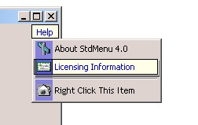

## Office Interface \(97\-2000\-XP\)

### Description

This class allows you to replace the standard Visual Basic menu with one that supports many more features, some of which include:Addition of bitmaps or icons to menu items (supports any size). Optional MonoDefault state will only colorize icons of menu items that are selected (a la Outlook Express) Extended keyboard shortcut keys, using Ctrl+, Shift+, Ctrl+Shift+, combinations, function keys, system keys, the menu and print keys, and the CapsLock key. Draws in the style of the Office 97 menu bar. Implements Visual Studio-menu style check marks and radio buttons. Implements Hot-tracking, Hot-lighted and Clear-box highlighting visual effects. Implements a "CaptionSeperator" item-type which is a Seperator Bar with scaled, centered text and optional background coloring and submenu support. Implements Color-select, a type of highlighting that lets the highlight bar be different than the system default Background gradients Multi-line menu items DBCS (Unicode) support for languages such as Chinese Each feature is Item-by-item. You can have a whole menu full of items that colorize or highlight differently. Version Upgrades: 4.1 (07/01/2001), 4.0 (06/18/01), 3.0 (02/22/2001) and 2.3 (10/28/2000): New Features include support for MDI Parent and child menus, each item may have its own Font, right-justification of menu items, and support for menu breaks and menu bar-breaks. In Version 4.0, the object model was completely revamped and simplified, developer documentation is now included, and a number of new features, such as support for background gradients, multi-line menu items, and Unicode, were added. Version 4.1 adds Office XP style flat menus.

----

It's not my code !!!

It's a Nathan Moschkin code. I find it on the web.

Thanks for his job.

----

 
### More Info
 

             |
---                |---
**Submitted On**   |2001-07-01 18:17:54
**By**             |[Christophe HUMBERT](https://github.com/Planet-Source-Code/PSCIndex/blob/master/ByAuthor/christophe-humbert.md)
**Level**          |Advanced
**User Rating**    |4.3 (30 globes from 7 users)
**Compatibility**  |VB 5\.0, VB 6\.0
**Category**       |[Custom Controls/ Forms/  Menus](https://github.com/Planet-Source-Code/PSCIndex/blob/master/ByCategory/custom-controls-forms-menus__1-4.md)
**World**          |[Visual Basic](https://github.com/Planet-Source-Code/PSCIndex/blob/master/ByWorld/visual-basic.md)
**Archive File**   |[Office Int246148142001\.zip](https://github.com/Planet-Source-Code/christophe-humbert-office-interface-97-2000-xp__1-26176/archive/master.zip)

### API Declarations

A lot of !!!

